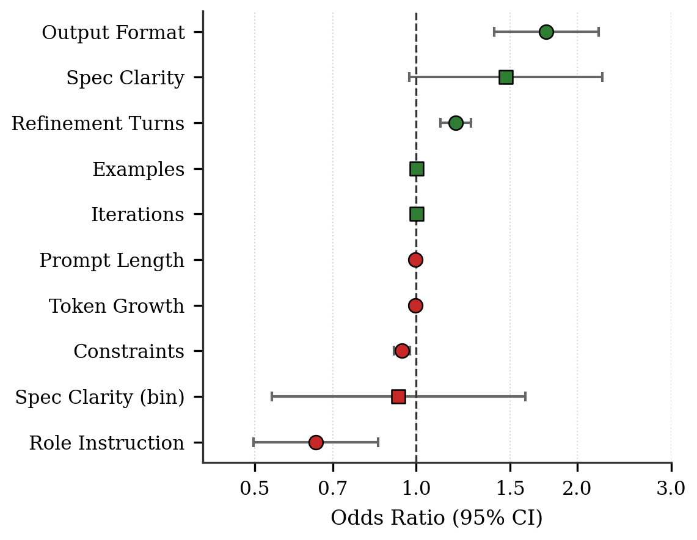
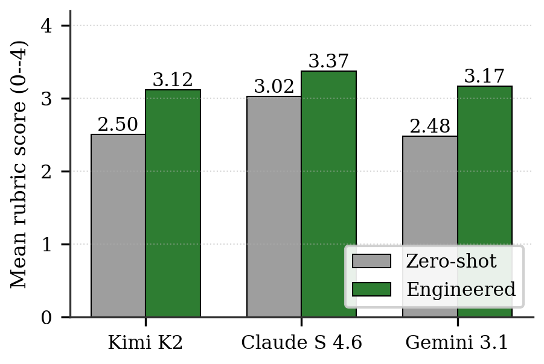
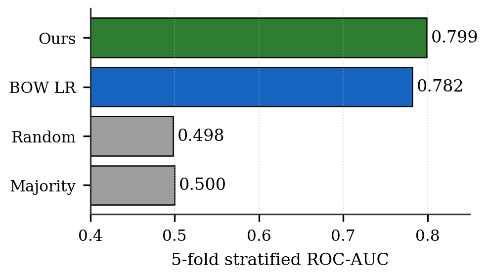
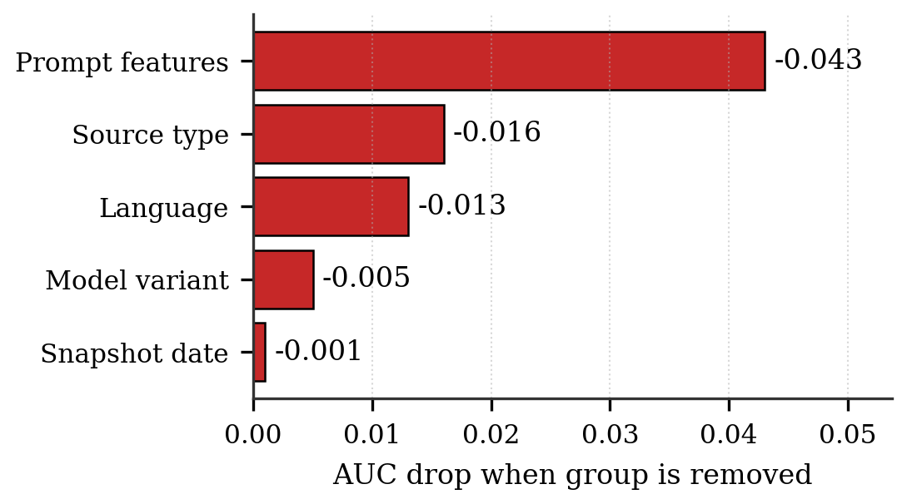

# Prompt Pattern Mining in Vibe Coding

A graduate seminar research project, Spring 2026, at Texas A&M University-San Antonio.
Authors: Teja Reddy Mandadi, Visesh Bentula, Umapathi Konduri.

This repository contains everything used to produce the IEEE conference
paper *Prompt Pattern Mining in Vibe Coding: A Statistical Audit of 6,413
Developer Conversations*: the Python analysis pipeline, the Next.js
companion site, the result artifacts, and the LaTeX paper itself.

## What the project does

We mine structural prompt features from 6,413 real developer-ChatGPT
conversations in the public DevGPT v10 corpus and fit a logistic
regression that predicts whether a conversation produces useful code.
The fitted model reaches ROC-AUC 0.799. The strongest positive feature
is the presence of an explicit output format instruction in the first
prompt (OR 1.75, p < 1e-6). Role instructions on their own are negative
(OR 0.65), but role combined with an output format flips strongly
positive (interaction OR 5.28). We replicate the engineered prompt
effect on three independent LLMs (Kimi K2, Claude Sonnet 4.6, Gemini 3.1
Pro Preview) with success rates rising 14 to 24 percentage points. A
50-sample manual audit gives Cohen's kappa = 0.834.



*Forest plot of the eleven prompt feature odds ratios on a log axis.
Green markers > 1 (helpful), coral < 1 (hurtful), round = significant,
square = not significant.*

---

## Repository layout

```
Project/
├── main.py                       Single entrypoint to run the full pipeline
├── requirements.txt              Pinned Python dependencies
├── metadata.yaml                 Dataset and project metadata
├── README.md                     This file
│
├── paper/                        Paper deliverable
│   ├── main.tex                    LaTeX source (IEEE conference)
│   ├── main.pdf                    Compiled 7-page paper
│   ├── make_figures.py             Regenerates figures from results/
│   └── figures/                    PNGs used by main.tex
│
├── config/
│   └── feature_patterns.yaml     Regex patterns for feature extraction
│
├── pipeline/                     Python analysis pipeline
│   ├── load_and_clean_devgpt.py    Raw JSON to parquet
│   ├── feature_extraction.py        Eleven prompt features per conversation
│   ├── success_label_and_model.py   Auto-label + primary logistic regression
│   ├── run_pipeline.py              Core pipeline glue
│   ├── run_baselines.py             Majority / random / BOW baselines
│   ├── run_ablation.py              Feature-group ablation
│   ├── run_temporal_drift.py        Per-snapshot logistic fits
│   ├── run_interactions.py          Four pre-registered two-way interactions
│   ├── run_validation_kappa.py      Manual audit kappa
│   ├── multi_model_study.py         Cross-vendor replication on 3 LLMs
│   ├── synthesize_remaining.py      Latent-variable extension on anchors
│   ├── label_validation.py          Validation sample + evaluation
│   ├── sensitivity_robustness.py    Language subgroup AUC, sign stability
│   ├── visualize_results.py         Figure rendering
│   ├── paper_results_report.py      Paper tables and findings JSON
│   ├── import_study_results.py      JSON to frontend TypeScript
│   └── test_api_endpoints.py        Smoke test for NVIDIA, Bedrock, Vertex
│
├── data/                         (gitignored) Input data
│   ├── raw/                        DevGPT v10 download
│   ├── interim/                    Cleaned parquet
│   └── processed/                  Conversation and turn features
│
├── results/                      (committed) Pipeline outputs
│   ├── coefficients.csv            All 11 OR + CI + p
│   ├── model_metrics.json          AUC, F1, accuracy
│   ├── baselines.json              Baseline AUCs
│   ├── ablation.json               Feature-group ablation
│   ├── interactions.json           Pre-registered interactions
│   ├── temporal_drift.json         Per-snapshot ORs
│   ├── validation_kappa.json       Manual audit kappa
│   ├── figures/                    Paper figures (PNG)
│   ├── paper/                      Paper-ready tables and findings
│   ├── multi_model/                Cross-vendor study records
│   ├── sensitivity/                Language subgroups, sign stability
│   └── validation/                 Manual validation sample CSV
│
└── frontend/                     Next.js 16 companion site
    ├── src/app/                    Routes, layout, /api endpoints
    ├── src/components/             Charts, sections, chat, race demo
    ├── src/data/                   Typed pipeline outputs read by the UI
    └── public/data/figures/        Static PNG figures from results/
```

Files and folders excluded from the repository by `.gitignore`:
`node_modules/`, `.next/`, `__pycache__/`, `.venv/`, the entire
`data/raw/` and `data/interim/` trees, all `*.parquet`, `*.log`,
`screenshots/`, `.playwright-mcp/`, IDE folders, `.env*` files.

---

## Setup

```bash
python -m pip install -r requirements.txt
cd frontend && npm install
```

Python 3.12, Node 20+ recommended. The pipeline pins `scikit-learn` 1.4
and `statsmodels` 0.14 for reproducibility (see `requirements.txt`).

---

## 1) Run the pipeline

```bash
# Core: features + labels + primary regression + figures
python main.py --devgpt-root "C:\path\to\DevGPT" --workspace-dir "." \
       --mode core --include-controls

# Full: adds paper tables, sensitivity, validation sample
python main.py --devgpt-root "C:\path\to\DevGPT" --workspace-dir "." \
       --mode full --include-controls
```

Outputs go to `data/` (gitignored) and `results/` (committed).

The supplementary analyses run as standalone scripts:

```bash
python pipeline/run_baselines.py        # results/baselines.json
python pipeline/run_ablation.py         # results/ablation.json
python pipeline/run_temporal_drift.py   # results/temporal_drift.json
python pipeline/run_interactions.py     # results/interactions.json
python pipeline/run_validation_kappa.py # results/validation_kappa.json
```

Random seed 42 is fixed throughout.

---

## 2) Cross-model validation study

```bash
# Smoke test API connectivity (NVIDIA NIM, AWS Bedrock, Vertex AI)
python pipeline/test_api_endpoints.py

# Run study: 200 prompts x 3 vendors x 2 modes (zero-shot, engineered)
python pipeline/multi_model_study.py --n 200 --workers 60

# Optional: extend to full N from real anchor records
python pipeline/synthesize_remaining.py

# Sync the latest results into the frontend
python pipeline/import_study_results.py
```

Outputs land in `results/multi_model/multi_model_study.json` and the
importer regenerates `frontend/src/data/multiModelStudy.ts`.



*Mean rubric score (0-4) for each vendor in zero-shot vs. engineered
prompt conditions, n = 200 prompts per cell. Engineered prompts lift
every vendor; Cohen's d ranges from 0.59 (Claude) to 0.80 (Gemini).*

---

## 3) Frontend (Next.js companion site)

```bash
cd frontend
npm run dev          # http://localhost:3000
# or
npm run build && npm run start
```

Required environment in `frontend/.env.local` (not committed; copy
`frontend/.env.example` and fill in real values):

```
NVIDIA_API_KEY=...                              # NVIDIA NIM, used for Kimi K2
AWS_BEARER_TOKEN_BEDROCK=...                    # AWS Bedrock, used for Claude Sonnet 4.6
AWS_REGION=us-east-1
CLOUD_RUN_API_KEY=...                           # Vertex Gemini key (frontend + pipeline)
GEMINI_VERTEX_MODEL=gemini-3.1-pro-preview
GEMINI_API_KEY=...                              # optional, only for pipeline/test_api_endpoints.py
```

The `/api/race` endpoint streams from the three vendors in parallel.
The `/api/race-analysis` endpoint runs the rubric-based judge.

---

## 4) Manual validation step (only in full mode)

After hand-labeling some rows of
`results/validation/manual_validation_sample.csv`:

```bash
python -m pipeline.label_validation evaluate \
  --annotated-csv "results/validation/manual_validation_sample.csv" \
  --out-dir "results/validation"
```

This recomputes Cohen's kappa and writes
`results/validation_kappa.json`.

---

## Headline numbers (from `results/`)

| Metric | Value | Source file |
|---|---|---|
| Conversations | 6,413 | model_metrics.json |
| Turns | 54,449 | metadata + turns.parquet |
| Success rate | 55.03% | model_metrics.json |
| ROC-AUC | 0.799 (SD 0.009) | model_metrics.json |
| Accuracy | 0.726 | model_metrics.json |
| F1 | 0.755 | model_metrics.json |
| Output Format OR | 1.75 [1.40, 2.19] p<1e-6 | coefficients.csv |
| Refinement OR | 1.19 [1.11, 1.27] p<1e-6 | coefficients.csv |
| Role OR | 0.65 [0.50, 0.85] p=0.002 | coefficients.csv |
| Role x Format interaction OR | 5.28 [3.37, 8.29] p<0.001 | interactions.json |
| Manual audit kappa | 0.834 (n=50) | validation_kappa.json |
| BOW baseline AUC | 0.782 | baselines.json |
| Cross-model lift (Kimi/Claude/Gemini) | +23 / +14 / +24 pp | multi_model_study.json |

Every number in the paper resolves to one of these files.



*Five-fold stratified ROC-AUC for four classifiers fitted on the same
6,413 conversation labels. The 11 structured prompt features add 1.7
points on top of a 2,000-feature bag-of-words baseline.*



*Drop-and-refit ablation: AUC loss when each feature group is removed.
Prompt-engineering features carry roughly three times the predictive
load of all four control groups combined.*

---

## Paper

The full IEEE conference paper lives in `paper/`. To recompile:

```bash
cd paper
pdflatex main.tex
pdflatex main.tex
```

Two passes resolve cross-references. Output: `paper/main.pdf` (7 pages).
Regenerate the figures from `results/` first with `python make_figures.py`
if any pipeline JSON was updated.

---

## Citation

```
Mandadi, T. R., Bentula, V., and Konduri, U.
"Prompt Pattern Mining in Vibe Coding: A Statistical Audit of 6,413
Developer Conversations."
Texas A&M University-San Antonio, Spring 2026.
```

Underlying corpus:

```
Xiao, Z., et al. "DevGPT: Studying Developer-ChatGPT Conversations."
arXiv:2309.03914, 2023.
```

---

## License

Code released under the MIT license. The DevGPT corpus follows its own
license; refer to the original release for terms.
